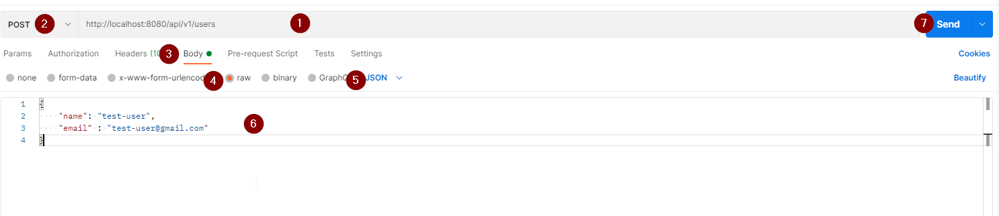

# Application producer

Simple message producer with Apache kafka

## How to run it

1. Move to the root directory
2. Execute the following command: `mvn spring-boot:run`

# API resources
| Description | Method | Route |
|   :---:         |     :---:      |     :---:     |
| Produce a new message  | POST     | /api/v1/users   |

## Produce new message

###  Via Apache Kafka

* [Step number 4 : Write some events into the topic](https://kafka.apache.org/quickstartr)  

### Via application end point (Linux)

On a terminal execute: 

`curl -d '{"name": "Carlos", "email" : "Carlos@gmail.com"}' -H 'Content-Type: application/json' http://localhost:8080/api/v1/users`

### Via application end point (POSTMAN)

1. Add `http://localhost:8080/api/v1/users` the text box
2. Select POST request.
3. Change to `Body` tab.
4. Select raw.
5. Select JSON.
6. Add ad body JSON to the text area.
7. Click send.

